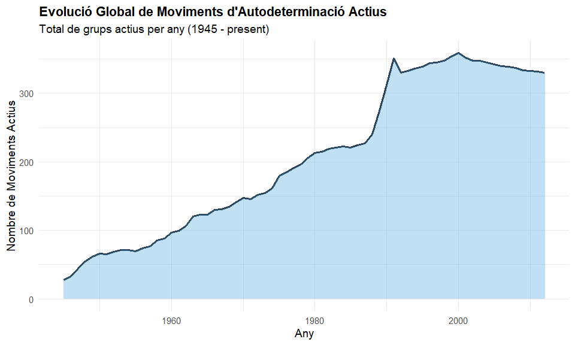
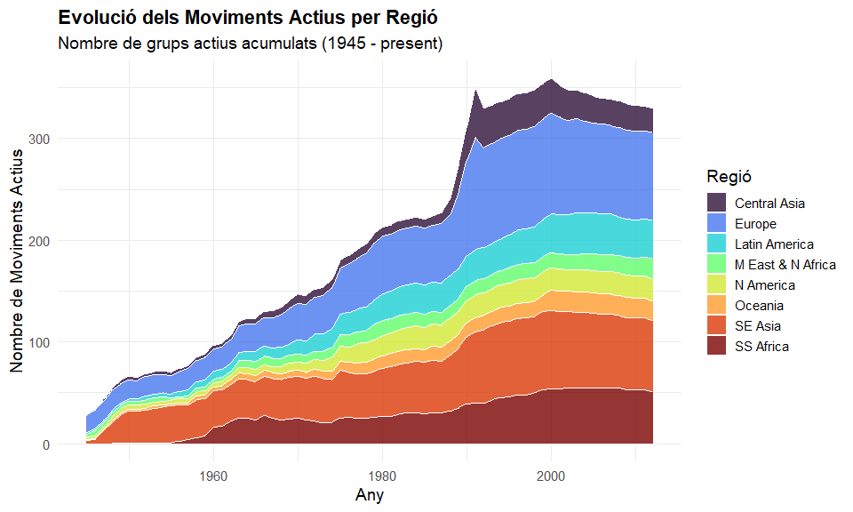
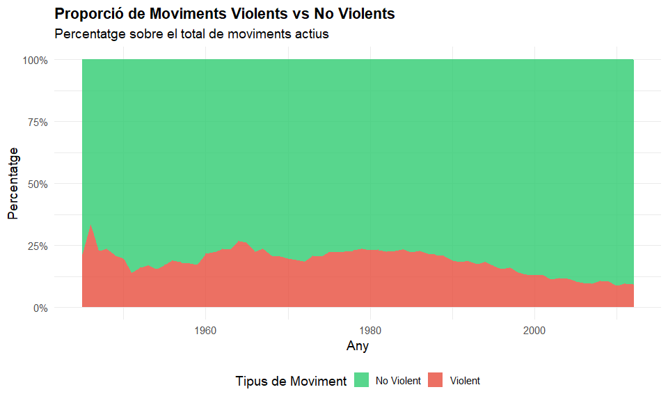
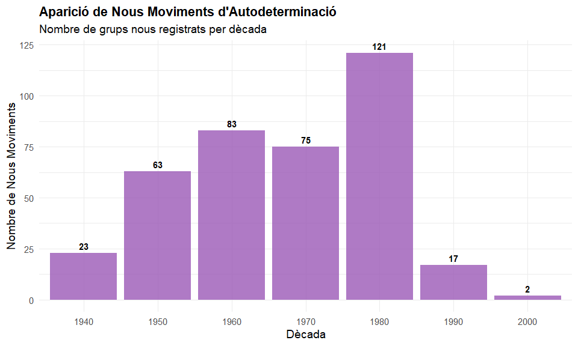
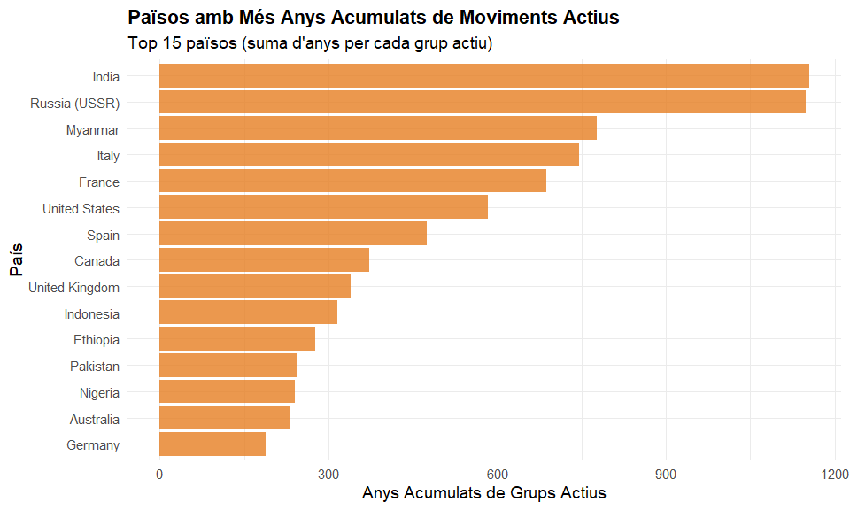

Evolució dels Moviments d’Autodeterminació (SDM)
================
Anàlisi de Dades
2026-04-22

## Introducció i Anàlisi de les Coding Notes

Els documents **“SDM Coding Notes I.pdf”** i **“SDM Coding Notes
II.pdf”** acompanyen el codi base (SDM Codebook) i recullen les
decisions de codificació qualitativa per a cada grup i país al llarg del
temps. Aquests documents són fonamentals perquè justifiquen
històricament per què un moviment es considera “actiu” (`active`), quin
tipus de demanda fa (`claim`), i si utilitza la violència (`violsd`,
`hviolsd`) en anys específics.

L’anàlisi d’aquestes notes revela que la definició de moviments
d’autodeterminació (SDM) no és estàtica, sinó que respon a canvis en el
lideratge, l’acció estatal i les dinàmiques regionals. En aquest sentit,
la variable de violència o el pas a la fase de latència o resolució
s’avaluen amb un rigorós criteri històric.

A continuació, presentem cinc figures elaborades a partir del fitxer
estructurat `SDM.csv` per il·lustrar l’evolució d’aquests moviments a
nivell global.

``` r
# Carreguem les dades
sdm_data <- read.csv("SDM.csv", stringsAsFactors = FALSE)

# Filtrem dades anòmales i netegem els anys
sdm_data <- sdm_data %>%
  filter(year >= 1945 & year <= 2020) %>%
  mutate(
    active = as.numeric(active),
    violsd = as.numeric(violsd),
    region = as.character(region)
  )
```

## Figura 1: Evolució Global de Moviments Actius

Aquesta figura mostra el nombre total de moviments d’autodeterminació
actius al món des de la fi de la Segona Guerra Mundial.

``` r
evolucio_global <- sdm_data %>%
  filter(active == 1) %>%
  group_by(year) %>%
  summarise(total_actius = n(), .groups = "drop")

ggplot(evolucio_global, aes(x = year, y = total_actius)) +
  geom_line(color = "#2c3e50", size = 1.2) +
  geom_area(fill = "#3498db", alpha = 0.3) +
  theme_minimal(base_size = 14) +
  labs(
    title = "Evolució Global de Moviments d'Autodeterminació Actius",
    subtitle = "Total de grups actius per any (1945 - present)",
    x = "Any",
    y = "Nombre de Moviments Actius"
  ) +
  theme(plot.title = element_text(face = "bold"))
```

<!-- -->

## Figura 2: Dinàmiques per Regió

Com s’han distribuït aquests moviments segons la regió geogràfica? Aquí
observem la tendència per a les principals regions del món.

``` r
evolucio_regio <- sdm_data %>%
  filter(active == 1, !is.na(region), region != "") %>%
  group_by(year, region) %>%
  summarise(total_actius = n(), .groups = "drop")

ggplot(evolucio_regio, aes(x = year, y = total_actius, fill = region)) +
  geom_area(alpha = 0.8, color = "white", size = 0.2) +
  scale_fill_viridis_d(option = "turbo") +
  theme_minimal(base_size = 14) +
  labs(
    title = "Evolució dels Moviments Actius per Regió",
    subtitle = "Nombre de grups actius acumulats (1945 - present)",
    x = "Any",
    y = "Nombre de Moviments Actius",
    fill = "Regió"
  ) +
  theme(plot.title = element_text(face = "bold"), legend.position = "right")
```

<!-- -->

## Figura 3: La Violència en els Moviments d’Autodeterminació

Una de les dimensions més crítiques és si el moviment utilitza la
violència (`violsd`). Aquest gràfic mostra la proporció de moviments
actius que recorren a tàctiques violentes respecte als no violents.

``` r
evolucio_violencia <- sdm_data %>%
  filter(active == 1, !is.na(violsd)) %>%
  mutate(tipus = ifelse(violsd == 1, "Violent", "No Violent")) %>%
  group_by(year, tipus) %>%
  summarise(total = n(), .groups = "drop") %>%
  group_by(year) %>%
  mutate(proporcio = total / sum(total))

ggplot(evolucio_violencia, aes(x = year, y = proporcio, fill = tipus)) +
  geom_area(alpha = 0.8) +
  scale_fill_manual(values = c("Violent" = "#e74c3c", "No Violent" = "#2ecc71")) +
  scale_y_continuous(labels = percent_format()) +
  theme_minimal(base_size = 14) +
  labs(
    title = "Proporció de Moviments Violents vs No Violents",
    subtitle = "Percentatge sobre el total de moviments actius",
    x = "Any",
    y = "Percentatge",
    fill = "Tipus de Moviment"
  ) +
  theme(plot.title = element_text(face = "bold"), legend.position = "bottom")
```

<!-- -->

## Figura 4: Aparició de Nous Moviments per Dècada

Analitzem en quines dècades han sorgit més moviments nous (anys on el
grup passa a ser actiu per primera vegada en una fase).

``` r
nous_moviments <- sdm_data %>%
  filter(fygroup == 1) %>%
  mutate(decada = floor(year / 10) * 10) %>%
  filter(decada >= 1940) %>%
  group_by(decada) %>%
  summarise(nous = n(), .groups = "drop")

ggplot(nous_moviments, aes(x = factor(decada), y = nous)) +
  geom_col(fill = "#9b59b6", alpha = 0.8) +
  geom_text(aes(label = nous), vjust = -0.5, fontface = "bold") +
  theme_minimal(base_size = 14) +
  labs(
    title = "Aparició de Nous Moviments d'Autodeterminació",
    subtitle = "Nombre de grups nous registrats per dècada",
    x = "Dècada",
    y = "Nombre de Nous Moviments"
  ) +
  theme(plot.title = element_text(face = "bold"))
```

<!-- -->

## Figura 5: Països amb Més Historial de Moviments Actius

Finalment, mostrem els 15 països que han acumulat més “anys de grup
actiu” (sumant els anys actius de tots els moviments al país).

``` r
top_paisos <- sdm_data %>%
  filter(active == 1) %>%
  group_by(country) %>%
  summarise(anys_acumulats = n(), .groups = "drop") %>%
  arrange(desc(anys_acumulats)) %>%
  slice_head(n = 15)

ggplot(top_paisos, aes(x = reorder(country, anys_acumulats), y = anys_acumulats)) +
  geom_col(fill = "#e67e22", alpha = 0.8) +
  coord_flip() +
  theme_minimal(base_size = 14) +
  labs(
    title = "Països amb Més Anys Acumulats de Moviments Actius",
    subtitle = "Top 15 països (suma d'anys per cada grup actiu)",
    x = "País",
    y = "Anys Acumulats de Grups Actius"
  ) +
  theme(plot.title = element_text(face = "bold"))
```

<!-- -->

## Conclusions

L’anàlisi combinada de la base de dades i les “Coding Notes” permet
observar com els moviments d’autodeterminació han experimentat onades
històriques de creixement i variacions regionals significatives. Tot i
que l’ús de la violència ha estat present en un percentatge rellevant
dels casos, també destaquen les llargues trajectòries de moviments no
violents. Aquest document serveix com a punt de partida per a estudis
més profunds sobre la resolució d’aquests conflictes.
